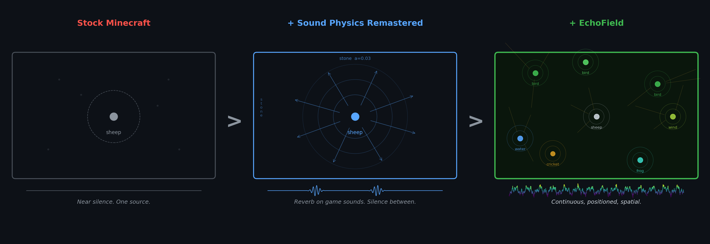
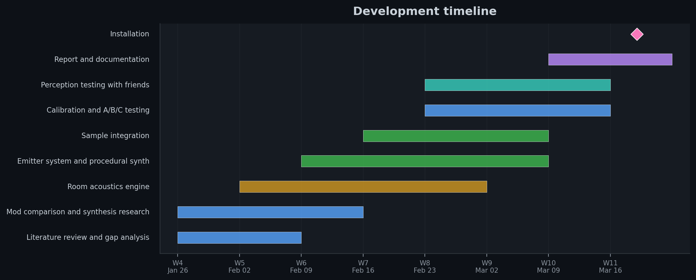
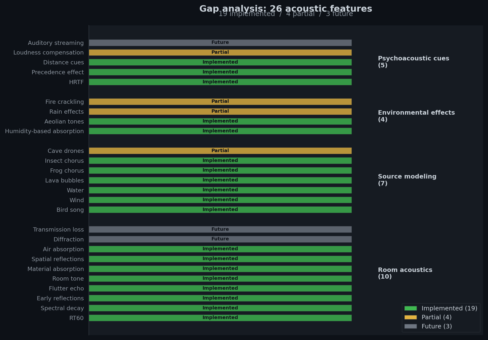
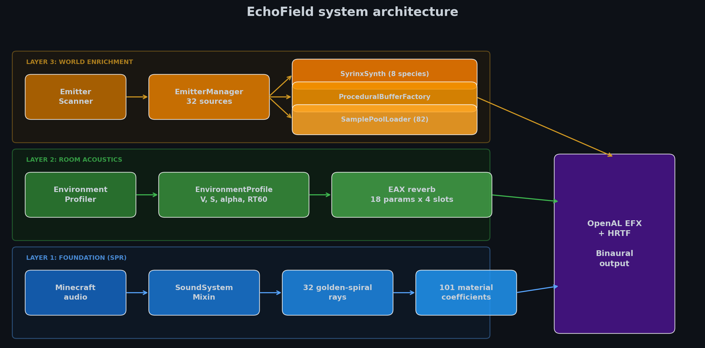
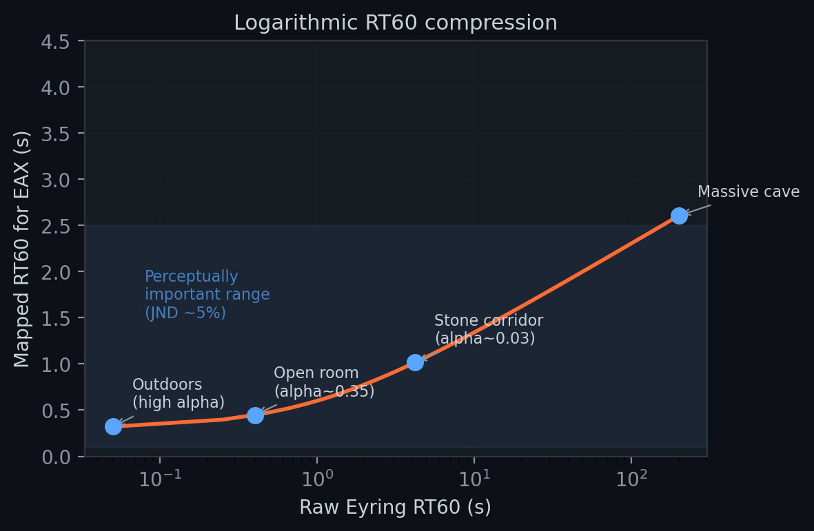
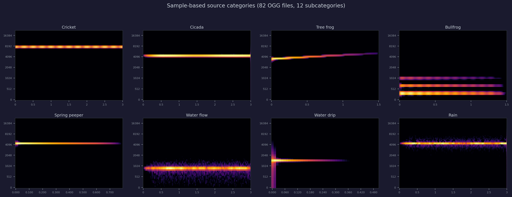
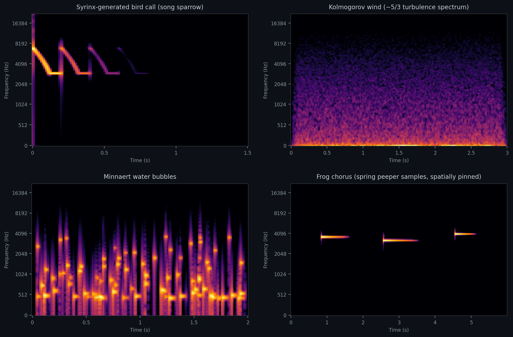
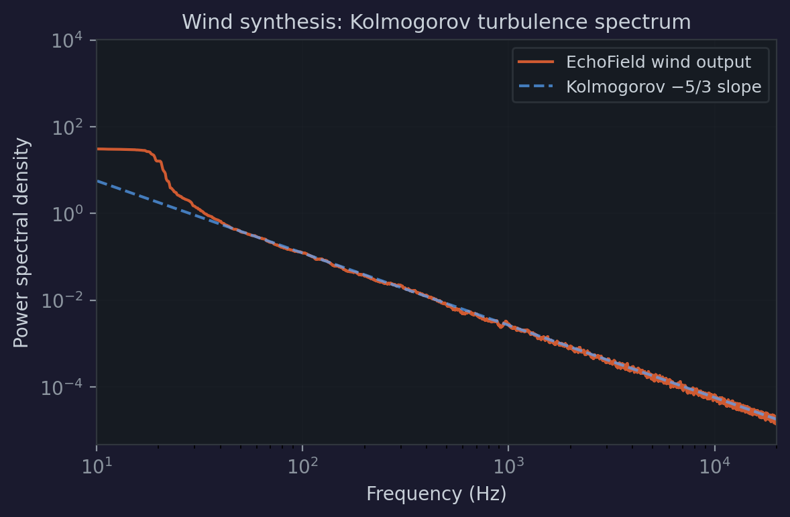

# EchoField

## Physics-based spatial audio and natural sound environments for Minecraft



Will Napier | DESE61003 Audio Experience Design | March 2026

*Individual project. All research, design, implementation, and documentation are my own work.*

---

Spatial audio matures inside games before it transfers anywhere else. OpenAL started as a game API and became the standard for accessibility research [13]. HRTF work driven by VR gaming now feeds hearing aid personalization. Ray-traced propagation built for games by Schissler and Manocha [9] is used in architectural acoustics now.

Minecraft has 200 million monthly players navigating procedurally generated 3D worlds, already used as an academic research platform [14]. But acoustically it's barren: no reverberation, no occlusion, no frequency-dependent material response. Playing with headphones is like standing in an anechoic chamber with a sheep.

Community mods fall short from both sides. Sound Physics Remastered adds reverb per game sound, but the world between events stays silent. AmbientSounds maps mono tracks to biomes — walk into a forest and hear forest.mp3 centered on your skull, contradicting every spatial cue your eyes are giving you. EchoField fills this gap by populating the world with individually positioned sources grounded in physical and biological models, rendered through a geometry-driven room acoustics engine with HRTF. Losing it feels like losing a sense: and during perception testing, every person I showed it to said more or less the same thing when I toggled it off.

> **[Video walkthrough](echofield-demo.mp4)** (headphones required)

---

## Development timeline



Development ran across Weeks 4–11. Research and gap analysis came first, followed by the room acoustics foundation, then the emitter and synthesis systems. Calibration and perception testing with friends ran through Weeks 8–10, feeding back into gain tuning and spatial parameter adjustments. The codebase is 15,000+ lines of new Java across 172 files and 83 commits, built as a Fabric mod forking SPR on Minecraft 1.21.1.

---

## Research and gap analysis



A systematic comparison between real-world acoustics and Minecraft audio identified 26 missing phenomena, categorized by perceptual impact [11]. The highest-impact gaps: room tone, early reflections in the 1–50ms window [1], frequency-dependent transmission, and diffraction. None existed in any Minecraft mod.

The analysis surfaced a more basic problem: even with perfect reverb, Minecraft has almost nothing to reverberate. The world is silent between occasional mob sounds. This shaped the two-pronged approach: build the acoustics, and build the sounds. 19 of 26 gaps are now fully implemented, 4 partial, 3 reserved for future work (diffraction, transmission loss, auditory streaming).

---

## System architecture



Three layers, all client-side through OpenAL EFX with HRTF enforced. Mixin bytecode injection hooks Minecraft's audio pipeline: `SoundSystemMixin` intercepts every `play()` call, `SourceMixin` sets OpenAL source properties before sound reaches hardware.

The Cloth Config GUI exposes per-category emitter toggles for all 15 source types, density controls, perceptual overrides (D/R ratio, air absorption, humidity), and a debug renderer. An A/B/C keybind cycles Vanilla / Physics-only / Full EchoField, all updating in real time.

All 18 EAX reverb parameters across 4 slots recompute every tick from live geometry. No presets anywhere:

```java
// EapSystem.java — EAX parameter override from live geometry
for (int i = 0; i < 4; i++) {
    int reverbEffect = SoundPhysics.getReverbEffect(i);
    EXTEfx.alEffectf(reverbEffect, AL_EAXREVERB_DECAY_TIME, decayTime);
    EXTEfx.alEffectf(reverbEffect, AL_EAXREVERB_DECAY_HFRATIO, hfRatio);
    EXTEfx.alEffectf(reverbEffect, AL_EAXREVERB_DECAY_LFRATIO, lfRatio);
    EXTEfx.alEffectf(reverbEffect, AL_EAXREVERB_DENSITY, density);
    EXTEfx.alEffectf(reverbEffect, AL_EAXREVERB_AIR_ABSORPTION_GAINHF, airAbsorption);
    EXTEfx.alEffectf(reverbEffect, AL_EAXREVERB_REFLECTIONS_DELAY, reflDelay);
    EXTEfx.alEffectf(reverbEffect, AL_EAXREVERB_REFLECTIONS_GAIN, reflGain);
    EXTEfx.alEffectfv(reverbEffect, AL_EAXREVERB_REFLECTIONS_PAN,
        new float[]{panX, panY, panZ});  // spatial early reflections
    EXTEfx.alEffectf(reverbEffect, AL_EAXREVERB_ECHO_TIME, echoTime);
    EXTEfx.alEffectf(reverbEffect, AL_EAXREVERB_ECHO_DEPTH, echoDepth);
    // ... all 20 parameters from EnvironmentProfile
}
```

---

## Room acoustics engine

I chose Eyring over Sabine [4] because Sabine assumes low absorption. Minecraft rooms routinely have open walls where α approaches 1.0; Sabine still gives a positive RT60, Eyring correctly drives it toward zero:

$$RT_{60} = \frac{0.161 \cdot V}{-S \cdot \ln(1 - \bar{\alpha})}$$

Every tick, the `EnvironmentProfiler` fires rays in a golden spiral distribution through voxel geometry, recording position, delay, energy, material, and bounce order at each hit. These aggregate into an `EnvironmentProfile` with enclosure factor, RT60, 3-band spectral absorption, directional balance (eigenvalues of ray-hit direction covariance: spherical = diffuse field, elongated = corridor, used to orient `REFLECTIONS_PAN`), sky exposure, and volume. Profiles crossfade over 25 ticks (1.25s) because the brain maintains a running spatial model and breaking it is audible [1].

```java
// Eyring RT60 with logarithmic perceptual compression
float clampedAbsorption = Math.max(0.01f, Math.min(0.99f, avgAbsorption));
float eyringRT60 = 0.161f * volume /
    (-surfaceArea * (float) Math.log(1.0 - clampedAbsorption));
float compressedRT60 = 0.3f + 1.0f * (float) Math.log10(1.0f + eyringRT60);
```

A 4×4×8 stone corridor (V = 128 m³, S = 160 m², α ≈ 0.03) gives 4.2s raw, compressed to 1.0s for EAX. The compression preserves JND-level differences where they matter perceptually (Weber fraction ~5%) while clamping extremes to [0.1, 4.0]s.


*Logarithmic compression maps the wide Eyring range to a perceptually balanced EAX range. Annotated room examples show the mapping at key points.*

Each material has 3-band absorption (250 Hz / 2 kHz / 8 kHz) derived from ISO 354 measurement standards. Three bands is coarse, but constrained by the EAX API: `DECAY_HFRATIO` and `DECAY_LFRATIO` give exactly low, mid, and high. Representative α values: stone 0.02/0.04/0.05 (flat, long tail), wood 0.10/0.10/0.07 (mild HF loss), foliage 0.30/0.50/0.60 (steep treble absorption). Flutter echo detection finds opposing ray taps on hard surfaces (dot product < −0.8) for `ECHO_TIME`.

---

## Procedural and sample-based soundscapes

The `EmitterManager` maintains 32 OpenAL sources with priority-based stealing. Every 40 ticks, `EmitterScanner` classifies blocks in a 24-block radius using a MurmurHash3-based spatial distribution:

```java
// EmitterScanner.java — deterministic spatial pinning
if (state.is(BlockTags.LEAVES)) {
    BlockState above = level.getBlockState(pos.above());
    if (above.isAir()) {
        if (hash < 8)  return EmitterCategory.BIRD;      // ~3% canopy
        if (hash < 34) return EmitterCategory.WIND_LEAF;  // ~10% canopy
    }
}
```

Each source sits at world coordinates and passes through HRTF independently — three birds in different trees produce three distinct spatial positions, which is impossible with one ambient track. 82 OGG samples across 12 subcategories play with per-instance pitch (±5%) and gain (±2 dB) variation.


*8 of 12 sample subcategories shown. 82 OGG files total, each spatially pinned and HRTF-rendered from its world position.*

### Bird song: Mindlin-Laje syrinx model

Recordings loop recognizably after three plays. The Mindlin-Laje syringeal membrane model [2] produces natural variety through stochastic parameter variation:

$$\ddot{x} = -\omega_0^2 x - (\beta_1 + \beta_2 x^2 + \beta_3 \dot{x}^2)\dot{x} + (p - \kappa x^2)x$$

where *x* is membrane displacement, ω₀ the natural frequency (2.5–5.5 kHz for song sparrow), β₁ < 0 injects energy (the Hopf instability), β₂ and β₃ saturate amplitude, *p* is driving air pressure, and κ the nonlinear restoring coefficient. Below threshold pressure the membrane sits still; above it, oscillation starts abruptly — matching how real calls begin without fade-in [3]. Integrated at 44.1 kHz via RK4 (Euler diverges at realistic parameter values). Eight species, tracheal resonance via FIR comb filter, stochastic variation in pitch (12%), tempo (25%), pressure (25%).

### Wind, water, and emergence

Wind uses white noise shaped in the frequency domain by the Kolmogorov energy spectrum $E(k) \propto k^{-5/3}$, with aeolian whistling via Strouhal *f = 0.2v/d* [6]. Water uses Minnaert bubble resonance [5]:

$$f = \frac{1}{2\pi r}\sqrt{\frac{3\gamma P_0}{\rho}}$$

where *r* is bubble radius (1–8 mm), γ = 1.4 (air), P₀ = 101.3 kPa, and ρ the fluid density. Each bubble event is a damped sinusoid at its radius-dependent frequency. The same equation with ρ = 2500 kg/m³ generates lava's deeper register.

Frog choruses use an eagerness-threshold model inspired by Felix Hess's robot experiments:

```java
// EmitterManager.java — Felix Hess frog chorus emergence
e.eagerness += 0.015f;  // passive accumulation
for (Emitter other : pool.getActiveEmitters()) {
    if (other.category == FROG && nearby(other, e, 20)
            && currentTick - other.lastCallTick < 40) {
        e.eagerness += 0.025f;  // hearing neighbor boosts eagerness
        break;
    }
}
float threshold = 0.8f + rng.nextFloat() * 0.4f;
if (e.eagerness >= threshold) { e.eagerness = 0; /* call */ }
```

Each frog integrates eagerness passively, with nearby calling frogs boosting the rate. When eagerness crosses a stochastic threshold the frog calls and resets, producing emergent chorus synchronization with no central coordination.


*Top-left: syrinx song sparrow, descending syllable contours (2.5–5.5 kHz) with tracheal formant banding. Top-right: Kolmogorov wind. Bottom-left: Minnaert water bubbles. Bottom-right: frog chorus (spring peeper samples).*


*Power spectral density of synthesized wind closely tracks the theoretical Kolmogorov −5/3 slope.*

---

## Hearing physiology and perceptual design

I designed around how the auditory system processes spatial information, not what sounds pleasant. More reverb sounds nice but destroys distance cues. Procedural calls sound less polished than recordings but produce genuine spatial variety.

Spatial hearing is an active inferential process. The brain maintains a probabilistic spatial scene model, computed in the medial superior olive (MSO, for ITD) and lateral superior olive (LSO, for ILD), integrated with pinna-generated spectral cues in auditory cortex [11]. The 25-tick crossfade matters neurally: abrupt parameter changes force the brain to rebuild its spatial representation.

EchoField uses OpenAL Soft's generic HRTF (KEMAR). Listeners whose pinnae differ from KEMAR get systematic errors resolving the cone of confusion — the locus where ITD and ILD are identical — leading to elevation and front-back confusion. The system enforces HRTF at startup; without it, sources collapse to amplitude panning [8]. Early reflections within the precedence fusion window (1–5ms for clicks, up to 80ms for complex environmental sounds [1]) widen the apparent source and convey room shape. The `EarlyReflectionProcessor` allocates 8 sources to highest-energy taps within 50ms, weighted 70% energy / 30% lateral fraction — lateral reflections contribute more to spatial impression [1]. Distance cues combine inverse-square attenuation, per-source D/R ratio via critical distance computed from the Eyring RT60, and ISO 9613-1 air absorption [10] with biome-dependent humidity.

---

## Beyond simulation: spatial perception as a trainable sense

The original question went further than realism: could a dense spatial audio environment train spatial listening? Not sonification; Dubus and Bresin's review of 60 such projects found multi-parameter mappings create cognitive overload [15]. Those approaches provide information *about* space. None let you *hear* the space.

Norman et al. [16] found visual and auditory cortex changes after 10 weeks of echolocation training in sighted adults. Kaspar et al.'s feelSpace belt [17] produced "a direct feeling of knowledge" in 8 of 9 participants after 7 weeks. The AbES studies [12] found blind adolescents achieved 70–97% real-world navigation accuracy after 60 minutes with audio-based virtual environments. EchoField is built on the same principle: natural cues, positioned in the world, processed through existing pathways. I haven't run formal experiments yet, but the A/B/C system and metrics logger are implemented and ready. Missoni, Poole, and Picinali's finding that reverberation triggers adaptive head movement (R² = 0.81) [8] suggests the mechanisms are there.

A half-implemented extension explores *amplified acoustic hyperreality* — exaggerating spatial cues beyond physical accuracy to heighten proprioceptive awareness of the world. Think of it as a spatial audio magnifying glass: wider HRTF separation, boosted early reflections, enhanced distance gradients. The code is mostly in place (configurable gain curves, per-cue amplification sliders), but calibration proved too complex to finish alongside the core system. It's the obvious next research question: if accurate spatial audio trains perception, does amplified spatial audio train it faster?

---

## Installation and perception testing

The installation ran on March 17, 2026 at DBDE. Setup: my MacBook Pro running Minecraft 1.21.1 with EchoField, connected to AirPods Max via USB audio (wired mode, since Bluetooth latency breaks HRTF rendering). Visitors put on the headphones and explored freely, with the A/B/C toggle available so they could switch between Vanilla, Physics-only, and Full EchoField in real time.

Perception testing started earlier, during Weeks 8–10. I had friends play with headphones and used their reactions to calibrate. The things that came up repeatedly: bird density was initially way too high (it sounded like an aviary, not a forest), the wind-to-bird gain ratio needed careful balancing or the wind masked everything, cave reverb tails were too long before I added the logarithmic compression, and the frog chorus eagerness rate was originally so low that frogs called maybe once every eight minutes. The A/B/C toggle was the most useful development tool I built. Switching from Full back to Vanilla after ten minutes: nothing changed visually, but everyone said it felt like something was taken away. One person described it as "suddenly the world has depth."

---

## Conclusions and future work

Almost everything here connects back to module content. Eyring RT60, spectral decay, ITD and ILD, precedence, critical distance, air absorption — I encountered all of these in lectures and then had to make them work in real time on live geometry. That gap between understanding the equation and getting it to sound right is where most of the calibration went. Perceived loudness scaling looks clean on a slide; getting it to feel correct for a bird 40 blocks away in a reverberant cave took weeks.

The full source is documented across this repository: the room acoustics engine in `EapSystem.java`, synthesis in `SyrinxSynth.java` and `ProceduralBufferFactory.java`, the emitter pipeline in `EmitterManager.java` and `EmitterScanner.java`, and configuration via Cloth Config in `EchoFieldConfig.java`. Each synthesis model is parameterized from the literature cited here, and the Cloth Config GUI exposes every tunable for live experimentation.

The system synthesizes from physics [2, 3, 5, 6], pins 82 samples to world positions, and computes Eyring reverberation with 3-band spectral decay from live voxel geometry [4]. Future work: wave diffraction (UTD), frequency-dependent transmission (mass law), room coupling, and the amplified hyperreality experiments. The deeper question — whether this trains genuine spatial listening — is ready to test. Picinali's toolkit [7] proved real-time spatialization works interactively, and Poole's findings on reverberation-driven head movement [8] confirm the perceptual mechanisms. The next step is running the experiment.

---

## Acknowledgments

Thanks to Katarina Poole (and Lorenzo Picinali) for the module teaching that grounded this work. Sound Physics Remastered by SonicEther provided the foundation ray-tracing and occlusion system.

---

## References

[1] M. Barron and A.H. Marshall, "Spatial impression due to early lateral reflections in concert halls," *J. Sound Vib.*, vol. 77, no. 2, pp. 211-232, 1981.

[2] G.B. Mindlin and R. Laje, *The Physics of Birdsong*, Springer, 2005.

[3] R. Laje, T.J. Gardner, and G.B. Mindlin, "Neuromuscular control of vocalizations in birdsong: a model," *Phys. Rev. E*, vol. 65, no. 5, 2002.

[4] C.F. Eyring, "Reverberation time in 'dead' rooms," *J. Acoust. Soc. Am.*, vol. 1, no. 2A, pp. 217-241, 1930.

[5] M. Minnaert, "On musical air-bubbles and the sounds of running water," *Phil. Mag.*, vol. 16, no. 104, pp. 235-248, 1933.

[6] R. Selfridge, J.D. Reiss, E.J. Avital, and X. Tang, "Physically derived synthesis model of an aeolian tone," in *Proc. 141st Audio Eng. Soc. Conv.*, Los Angeles, CA, Sep. 2016, paper 9679.

[7] M. Cuevas-Rodriguez, L. Picinali, D. Gonzalez-Toledo, et al., "3D Tune-In Toolkit: An open-source library for real-time binaural spatialisation," *PLOS ONE*, vol. 14, no. 3, e0211899, 2019.

[8] F. Missoni, K.C. Poole, L. Picinali, and A. Canessa, "Effects of auditory distance cues and reverberation on spatial perception and listening strategies," *npj Acoustics*, 2025.

[9] C. Schissler and D. Manocha, "Interactive sound propagation and rendering for large multi-source scenes," *ACM Trans. Graph.*, vol. 36, no. 1, article 2, 2017.

[10] ISO 9613-1:1993, "Acoustics -- Attenuation of sound during propagation outdoors -- Part 1: Calculation of the absorption of sound by the atmosphere."

[11] A.J. Kolarik, B.C.J. Moore, P. Zahorik, S. Cirstea, and S. Pardhan, "Auditory distance perception in humans: a review of cues, development, neuronal bases, and effects of sensory loss," *Atten. Percept. Psychophys.*, vol. 78, no. 2, pp. 373-395, 2016.

[12] E.C. Connors, E.R. Chrastil, J. Sanchez, and L.B. Merabet, "Action video game play and transfer of navigation and spatial cognition skills in adolescents who are blind," *Front. Hum. Neurosci.*, vol. 8, article 133, 2014.

[13] F. Pausch, L. Aspock, M. Vorlander, and J. Fels, "An extended binaural real-time auralization system with an interface to research hearing aids," *Trends in Hearing*, vol. 22, 2018.

[14] M. Johnson et al., "The Malmo Platform for Artificial Intelligence Experimentation," *Proc. 25th Int. Joint Conf. Artif. Intell.*, 2016.

[15] G. Dubus and R. Bresin, "A systematic review of mapping strategies for the sonification of physical quantities," *PLoS One*, vol. 8, no. 12, 2013.

[16] L.J. Norman, T. Hartley, and L. Thaler, "Changes in primary visual and auditory cortex of blind and sighted adults following 10 weeks of click-based echolocation training," *Cereb. Cortex*, vol. 34, no. 6, bhae239, 2024.

[17] K. Kaspar et al., "The experience of new sensorimotor contingencies by sensory augmentation," *Conscious. Cogn.*, vol. 28, pp. 47-63, 2014.
